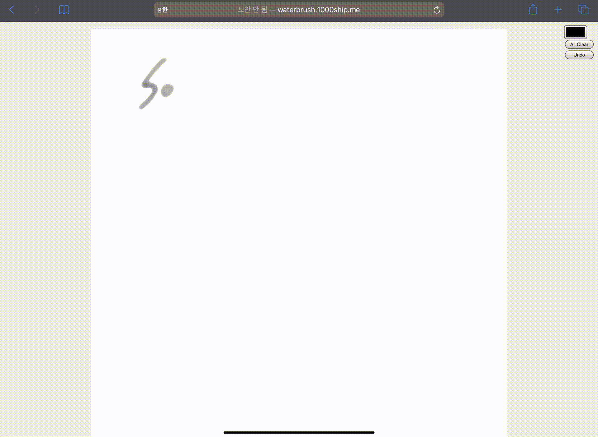
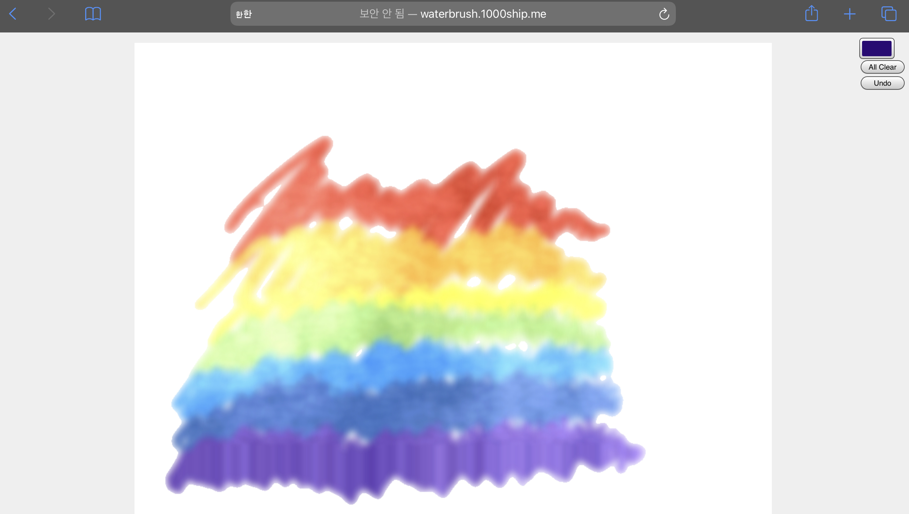

# Water Brush




## Demo

#### 	Try it here, https://waterbrush.1000ship.me/

- Recommand to use iPad with Apple Pencil

```bash
# After you clone this project
npm install
npm run start
```


## Dependency

- PixiJS (https://www.pixijs.com/)


## Rainbow

